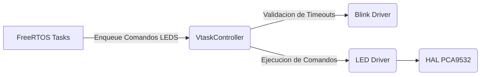

# PCA9532 Driver
**No releases yet**
- [ ] Biblioteca HAL PCA9532.
	- [x] Testing. 
	- [ ] Implementacion. 
- [ ] Biblioteca de Aplicacion de LED Driver.
	- [x] Testing.
	- [ ] Implementacion.
- [ ] Analisis de FreeRTOS.
	- [x] Diagrama.
	- [x] Testing de FreeRTOS Task.
	- [ ] Implementacion.      

Desarrollo de un driver para el manejo del IC [PCA9532](https://www.nxp.com/docs/en/data-sheet/PCA9532.pdf). 

Herramientas Necesarias:
- Ceedling: para el Testing.
- Doxygen para la documentacion.

Debido a que no dispongo del hardware para realizar la prueba correcta del sistema, y con el objetivo de proveer de un codigo funcional con la menor cantidad de incovenientes, se utiliza una metodologia basada de TDD (Test Development Driven). En esencia se considera que ya que no se puede validar el funcionamiento de forma empirica, realizar la mayor cantidad de pruebas posibles al Firmware para lograr entregar codigo funcional.

# Estrategia 

Se analizan 3 posibilidades para el manejo de los efectos LEDS:

 1. Creacion de Tareas OneShot.
 2. Creacion de Timers de FreeRTOS.
 3. Manejo local en vTaskController.

## Comparaciones

| Opcion | Ventajas | Desventajas | Seleccionada |
|--|--|--|--|
| OneShot | Facil Implementacion | Requiere memoria dinamica y el borrado de tareas  | - |
| Timers | Manejo delegado al kernel | Requiere memoria dinamica y el borrado de timers | - |
| Local | Memoria estatica  | No hace uso de los recursos de RTOS | X |

Basado en que las aplicaciones de MSA son principalmente **sistemas criticos**, se opto por una version mas segura. Se da prioridad a la opcion 3, ya que no requiere de Memoria Dinamica, de esta forma los recursos (memoria) quedan disponibles para tareas de mayor prioridad que el encendido de un LED.  

## Diagrama
Diagrama de arquitectura del driver:

## Notas

A pesar de no contar con el Hardware, se adquirio un IC similar (PCA9685) con el objetivo de probar los comandos i2C y analizar las tramas, aunque no fue posible alcanzar esta etapa todavia por cuestiones de tiempo, se tomo captura de las tramas para su posterior al analisis.
